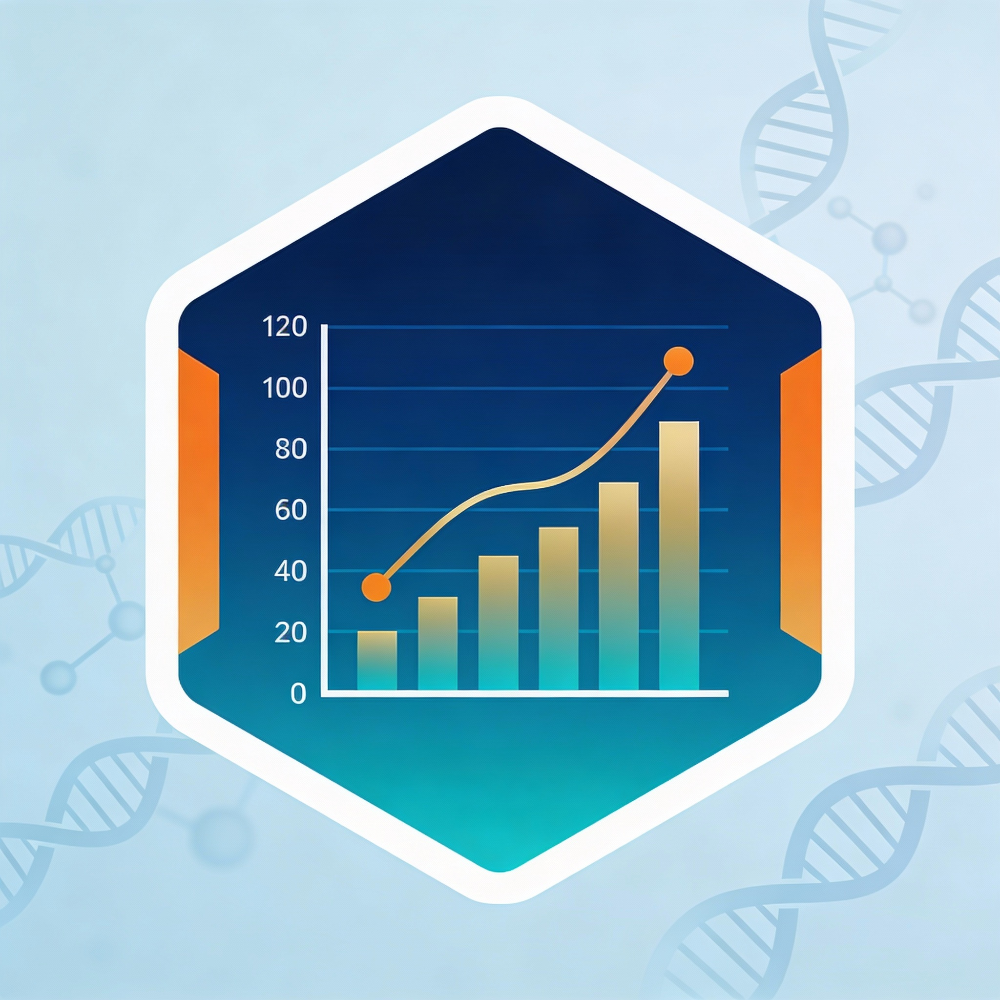

# MSCalculator

**Automated Module Score Calculator for Gene Expression Data**

A production-ready R tool for calculating module scores from bulk RNA-seq or microarray data with automatic gene ID conversion, flexible sample selection, and multiple scoring methods.

<p align="center">
  
</p>

[](https://opensource.org/licenses/MIT)
[](https://www.r-project.org/)

---

## 🎯 Key Features

- ✅ **Automatic gene ID conversion**: Ensembl ↔ Symbol (no setup required!)
- ✅ **Flexible column selection**: Choose any combination of samples by index or name
- ✅ **Multiple scoring methods**: mean, median, or z-score with expression-matched controls
- ✅ **Works with raw counts or normalized data**
- ✅ **Comprehensive diagnostics**: Step-by-step progress reporting and troubleshooting
- ✅ **Statistical testing & visualization** (optional ggplot2 integration)
- ✅ **CSV export functionality**
- ✅ **Zero installation**: Just source() and analyze!

---

## 🚀 Quick Start

### Installation

Simply source the R script directly from GitHub:

```r
source("https://raw.githubusercontent.com/Dragonmasterx87/MSCalculator/main/module_score_calculator.R")
```

No package installation required! Only base R dependency: `stats` (optional: `ggplot2` for plotting)

### Basic Usage

```r
# Load your data
counts <- read.csv("gene_rawCounts.csv", stringsAsFactors = FALSE)

# Define your gene set (mix Ensembl IDs and Symbols - it auto-converts!)
oxphos_genes <- c("Ndufa1", "Ndufa2", "Sdha", "Uqcrc1", "Cox5a", "Atp5f1a")

# Calculate module score
result <- calculate_module_score(
  count_matrix = counts,
  gene_set = oxphos_genes,
  method = "zscore"
)

# View results
print(result$module_scores)
```

---

## 🔥 Automatic Gene ID Conversion

**No more manual conversion needed!** The function automatically:

1. Detects if your data uses Ensembl IDs or gene symbols
2. Detects if your gene set uses Ensembl IDs or gene symbols  
3. Auto-converts between formats if there's a mismatch
4. Uses biomaRt if installed (optional, for best results)
5. Works without biomaRt using intelligent fallback methods

### Example: Data in Ensembl, Gene Set in Symbols

```r
# Your data has: ENSMUSG00000029368, ENSMUSG00000064351...
# Your gene set has: Ndufa1, Sdha, Cox5a...
# Function auto-converts symbols → Ensembl IDs!

result <- calculate_module_score(counts, oxphos_genes, method = "zscore")

# Output shows conversion progress:
# STEP 2: Gene ID analysis & auto-conversion...
#   ✓ Data IDs: Ensembl (ENSMUSG00000029368, ENSMUSG00000064351...)
#   ✓ Gene set: Symbol (Ndufa1, Sdha, Cox5a...)
#   🔄 Auto-converting gene IDs (Symbol → Ensembl)...
#   ✓ Converted: 48 genes
#   ✓ FINAL: 48/50 genes matched
```

---

## 📊 Flexible Sample Selection

Analyze **any combination** of samples with the `sample_columns` parameter:

```r
# Use all samples
result <- calculate_module_score(counts, genes, sample_columns = NULL)

# Select by column index (e.g., first 4 samples)
result <- calculate_module_score(counts, genes, sample_columns = 2:5)

# Select specific non-consecutive columns
result <- calculate_module_score(counts, genes, sample_columns = c(2, 4, 6, 8))

# Select by column name
result <- calculate_module_score(
  counts, genes, 
  sample_columns = c("Control_1", "Control_2", "Treatment_1", "Treatment_2")
)

# Unbalanced designs work fine!
result <- calculate_module_score(counts, genes, sample_columns = c(2, 3, 6, 7, 8, 9))
groups <- c(rep("Control", 2), rep("Treatment", 4))
```

---

## 📋 Complete Workflow Example

```r
# 1. Load function
source("https://raw.githubusercontent.com/Dragonmasterx87/MSCalculator/main/module_score_calculator.R")

# 2. Load data
counts <- read.csv("gene_rawCounts.csv", stringsAsFactors = FALSE)

# 3. Define gene sets for multiple pathways
oxphos_genes <- c("Ndufa1", "Ndufa2", "Sdha", "Sdhb", "Uqcrc1", "Cox5a", "Atp5f1a")
inflammation_genes <- c("Il6", "Tnf", "Il1b", "Ccl2", "Cxcl10")
fibrosis_genes <- c("Col1a1", "Col3a1", "Acta2", "Fn1", "Tgfb1")

# 4. Select specific samples (3 controls + 3 treatments)
selected_samples <- c(2, 3, 4, 6, 7, 8)

# 5. Calculate scores for all pathways
oxphos_result <- calculate_module_score(counts, oxphos_genes, selected_samples, "zscore")
inflam_result <- calculate_module_score(counts, inflammation_genes, selected_samples, "zscore")
fibro_result <- calculate_module_score(counts, fibrosis_genes, selected_samples, "zscore")

# 6. Define experimental groups
groups <- c(rep("Control", 3), rep("Treatment", 3))

# 7. Visualize results (requires ggplot2)
library(ggplot2)
plot_module_scores(oxphos_result, groups, "OXPHOS Pathway")
plot_module_scores(inflam_result, groups, "Inflammation")
plot_module_scores(fibro_result, groups, "Fibrosis")

# 8. Statistical testing
test_module_scores(oxphos_result, groups, "t.test")
test_module_scores(inflam_result, groups, "t.test")
test_module_scores(fibro_result, groups, "t.test")

# 9. Export results
export_scores(oxphos_result, groups, "OXPHOS", "oxphos_scores.csv")
```

---

## 🔬 Scoring Methods

### 1. Mean (Default - Fast & Simple)
```r
result <- calculate_module_score(counts, genes, method = "mean")
```
- Calculates average expression across genes in your set
- **Best for**: Quick exploratory analysis, well-defined pathways
- **Speed**: Very fast

### 2. Median (Robust to Outliers)
```r
result <- calculate_module_score(counts, genes, method = "median")
```
- Uses median instead of mean
- **Best for**: Data with extreme values or outliers
- **Speed**: Fast

### 3. Z-score (Publication Quality)
```r
result <- calculate_module_score(counts, genes, method = "zscore")
```
- Accounts for background expression using control genes
- Control genes are matched by expression level (binned approach)
- Similar to Seurat's `AddModuleScore` method
- **Formula**: `(module_mean - control_mean) / control_sd`
- **Best for**: Rigorous analysis, publications, cross-study comparisons
- **Speed**: Moderate (requires control gene selection)

---

## 📖 Main Functions

### `calculate_module_score()`

Calculate module/pathway scores with automatic gene ID conversion.

**Parameters:**
- `count_matrix`: Data frame/matrix with genes as rows, samples as columns (first column = gene IDs)
- `gene_set`: Character vector of gene IDs (Ensembl or symbols - auto-converts!)
- `sample_columns`: Numeric/character vector for column selection (default: `NULL` = all)
- `method`: `"mean"`, `"median"`, or `"zscore"` (default: `"mean"`)
- `normalize`: Log2 transform raw counts (default: `TRUE`)
- `control_size`: Control genes per module gene for zscore (default: `100`)
- `random_seed`: Reproducibility (default: `123`)
- `verbose`: Show diagnostic output (default: `TRUE`)

**Returns:**
- `module_scores`: Vector of scores for each sample
- `genes_found`: Genes successfully matched
- `genes_missing`: Genes not found in data
- `normalized_data`: Normalized expression matrix
- `samples_used`: Sample names analyzed

---

### `plot_module_scores()`

Visualize module scores with automatic statistical testing.

**Parameters:**
- `module_result`: Output from `calculate_module_score()`
- `groups`: Group labels (must match sample count)
- `title`: Plot title
- `colors`: Color palette (optional)
- `show_points`: Display individual points (default: `TRUE`)

**Requires:** `ggplot2` package

---

### `test_module_scores()`

Perform statistical tests between groups.

**Parameters:**
- `module_result`: Output from `calculate_module_score()`
- `groups`: Group labels
- `test`: `"t.test"`, `"wilcox"`, or `"anova"`

**Returns:** Statistical test results with formatted output

---

### `export_scores()`

Export scores to CSV file.

**Parameters:**
- `module_result`: Output from `calculate_module_score()`
- `groups`: Group labels
- `pathway_name`: Name for score column
- `output_file`: Output CSV path

---

## 📁 Data Format

Your input should have:
- **First column**: Gene IDs (Ensembl IDs or symbols - both work!)
- **Other columns**: Sample expression values (raw counts or normalized)

Example format:
```
gene_id           | Control_1 | Control_2 | Treatment_1 | Treatment_2
----------------- | --------- | --------- | ----------- | -----------
ENSMUSG00000029368 |   400984  |   499797  |    459560   |    593235
Ndufa2             |   268658  |   249360  |    284437   |    231158
ENSMUSG00000032554 |   247359  |   316049  |    345013   |    428319
```

---

## 🧬 Getting Gene Sets

### From GO/KEGG Enrichment Results
```r
# After running clusterProfiler enrichment
library(clusterProfiler)

# Extract genes from specific pathway
pathway_genes <- enrichment_result@result$geneID[
  enrichment_result@result$Description == "oxidative phosphorylation"
]
pathway_genes <- unlist(strsplit(pathway_genes, "/"))

# Calculate module score
result <- calculate_module_score(counts, pathway_genes, method = "zscore")
```

### From Public Databases
- **MSigDB**: [https://www.gsea-msigdb.org/gsea/msigdb/](https://www.gsea-msigdb.org/gsea/msigdb/)
- **GO/KEGG**: Via `clusterProfiler` or `org.Mm.eg.db` packages
- **Reactome**: [https://reactome.org/](https://reactome.org/)

### Custom Gene Lists
```r
# Define your own gene set
my_pathway_genes <- c("Ndufa1", "Sdha", "Uqcrc1", "Cox5a", "Atp5f1a")

# Or use Ensembl IDs
my_pathway_ensembl <- c(
  "ENSMUSG00000029368", 
  "ENSMUSG00000025941",
  "ENSMUSG00000025270"
)
```

See `oxphos_gene_set.R` for a comprehensive 88-gene OXPHOS pathway example!

---

## 💡 Tips & Best Practices

### 1. Gene ID Conversion
- **No setup needed** - function auto-converts
- For best results: `BiocManager::install('biomaRt')` (optional)
- Mix Ensembl and Symbols in same gene set - it handles it!

### 2. Choosing a Method
- **Exploration**: Use `"mean"` (fast)
- **Publication**: Use `"zscore"` (rigorous)
- **Outliers**: Use `"median"` (robust)

### 3. Normalization
- `normalize = TRUE` for raw counts (default)
- `normalize = FALSE` for TPM, RPKM, FPKM, or pre-normalized data

### 4. Sample Selection
- Start with all samples to assess overall patterns
- Use `sample_columns` to exclude outliers or focus on subsets
- Unbalanced designs (e.g., 2 vs 5 samples) work fine!

### 5. Gene Set Size
- **Minimum**: 5-10 genes
- **Optimal**: 20-100 genes (more robust statistics)
- **Small sets** (<5 genes): May be unstable, consider using more genes

### 6. Quality Control
- Check `result$genes_missing` to see unmatched genes
- Review diagnostic output (`verbose = TRUE`) for issues
- Verify gene ID format compatibility

---

## 🔧 Troubleshooting

### "None of the genes found"
**Solution**: Install biomaRt for better conversion
```r
install.packages('BiocManager')
BiocManager::install('biomaRt')
```

### "Columns not found"
**Solution**: Check exact column names
```r
colnames(counts)  # See available column names
```

### "Length of groups doesn't match"
**Solution**: Ensure groups vector matches selected samples
```r
# If selecting 6 columns
result <- calculate_module_score(counts, genes, sample_columns = c(2:7))
groups <- c("A", "A", "A", "B", "B", "B")  # Must be length 6
```

### Low gene match rate
**Solution**: Verify species and gene ID format
- Mouse: Ensembl IDs start with `ENSMUSG`, symbols like `Ndufa1`
- Human: Ensembl IDs start with `ENSG`, symbols like `NDUFA1`

---

## 📊 Real-World Use Cases

See `usage_examples.R` for 10 complete scenarios:

1. Standard comparison (4 controls vs 4 treatments)
2. Subset analysis (controls only or treatments only)
3. Multiple treatment groups (ANOVA)
4. Batch-wise analysis
5. Outlier handling and QC
6. Multiple pathways comparison
7. Unbalanced experimental designs
8. Time course experiments
9. Dose-response studies
10. Cross-platform comparisons

---

## 📚 Citation

If you use MSCalculator in your research, please cite:

```
Qadir, M.M.F. (2026). MSCalculator: Automated Module Score Calculator for 
Gene Expression Data. GitHub: https://github.com/Dragonmasterx87/MSCalculator
```

**BibTeX:**
```bibtex
@software{qadir2026mscalculator,
  author = {Qadir, Mirza Muhammad Fahd},
  title = {{MSCalculator}: Automated Module Score Calculator for Gene Expression Data},
  year = {2026},
  url = {https://github.com/Dragonmasterx87/MSCalculator},
  version = {1.0.0}
}
```

---

## 📧 Contact & Support

**Author**: Mirza Muhammad Fahd Qadir, DVM, MS, PhD  
**Email**: [fahdqadir@gmail.com](mailto:fahdqadir@gmail.com)  
**Institution**: Tulane University Health Sciences Center  
**GitHub**: [@Dragonmasterx87](https://github.com/Dragonmasterx87)

- **Questions?** Open an [issue](https://github.com/Dragonmasterx87/MSCalculator/issues)
- **Feature requests?** Submit a pull request
- **Found a bug?** Report it in [issues](https://github.com/Dragonmasterx87/MSCalculator/issues)

---

## 📄 License

MIT License - Free to use, modify, and distribute.

Copyright (c) 2026 Mirza Muhammad Fahd Qadir

See [LICENSE](LICENSE) file for details.

---

## 🙏 Acknowledgments

This tool was inspired by:
- **Seurat's `AddModuleScore`** - Expression-matched control gene approach
- **GSEA methodology** - Gene set enrichment concepts
- **Community feedback** - From collaborative research projects

Special thanks to collaborators and early users who provided valuable feedback during development.

---

## 🔗 Related Resources

- **Seurat**: [https://satijalab.org/seurat/](https://satijalab.org/seurat/)
- **clusterProfiler**: [https://bioconductor.org/packages/clusterProfiler/](https://bioconductor.org/packages/clusterProfiler/)
- **biomaRt**: [https://bioconductor.org/packages/biomaRt/](https://bioconductor.org/packages/biomaRt/)
- **MSigDB**: [https://www.gsea-msigdb.org/](https://www.gsea-msigdb.org/)

---

<p align="center">
  <b>Made with ❤️ for the bioinformatics community</b>
</p>
